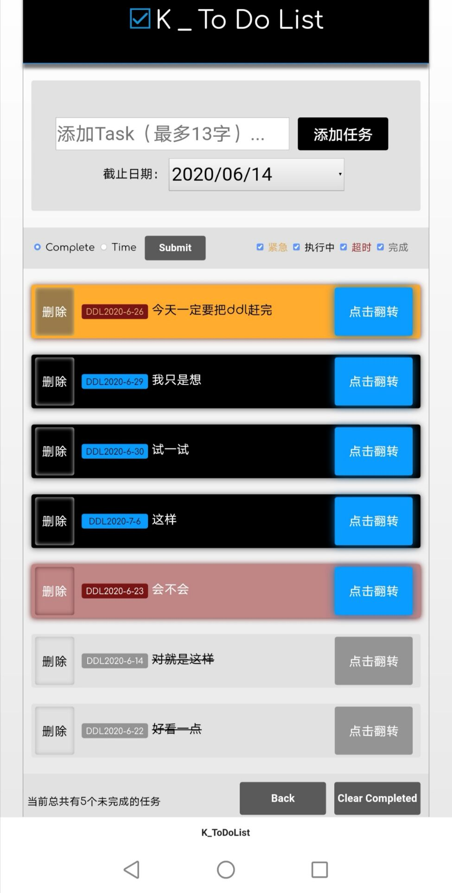

# readme

ckkkx

This is a pure html/css/js trial without any framework, so there is no animations.

Font by [this](https://fonts.googleapis.com/css?family=Comfortaa|Open+Sans:800,800).

Here is a sample view of it on mobile web page.

You can also go to https://st-ern.github.io/k_todoList/index.html to take a look.

**Watch! The style may not suit PC web page (when width small than 1280px), as the project is made for mobile web page as command** (sorry for my poor css ability i cant suit PC&mobile very well at the same time).

